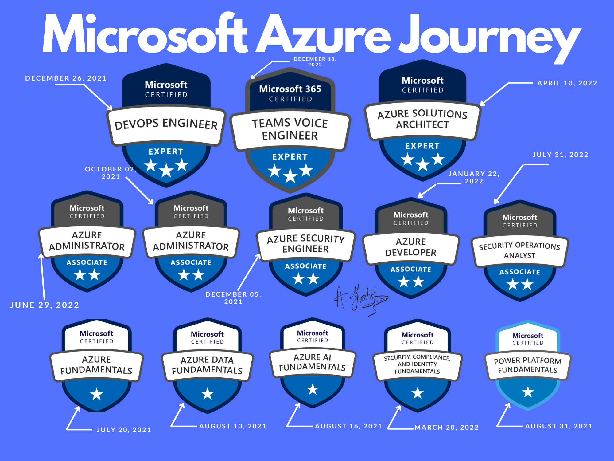
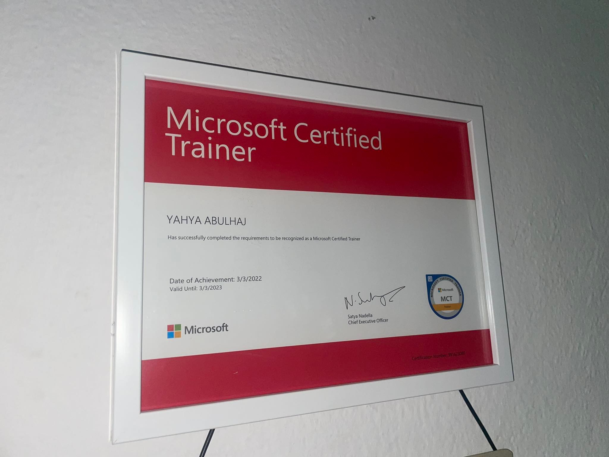
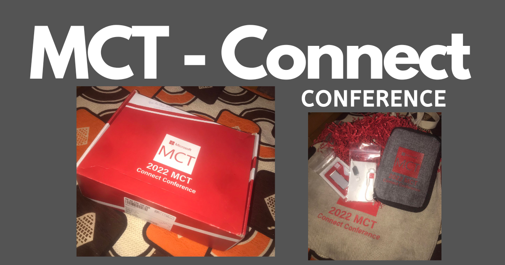

# Cloud Computing Journey

I am grateful for all of the knowledge and skills that I have earned, and I am eager to continue learning and growing as a professional. My journey has been filled with hard work and dedication, but it has also been incredibly rewarding.

 
 <b>Acquired Exams</b>  

 

> Sort by timeline.
- [1- Microsoft Azure Fundamentals](1°AZ-900.pdf)
- [2- Microsoft Azure Data Fundamentals ](2°DP-900.pdf)
- [3- Microsoft Azure AI Fundamentals ](3°AI-900.pdf)
- [4- Microsoft Power Platform Fundamentals ](4°PL-900.pdf)
- [5- Microsoft Azure Administrator Associate](5°AZ-104.pdf)
- [6- Microsoft Azure Security Engineer Associate](6°AZ-500.pdf)
- [7- Microsoft DevOps Engineer Expert](7°AZ-400.pdf)
- [8- Microsoft Azure Developer Associate](8°AZ-204.pdf)
- [9- Microsoft Certified Trainer 2022-2023](MCT.pdf)
- [10- Microsoft Security, Compliance, and Identity Fundamentals](9°SC-900.pdf)
- [11- Terraform Associate ](10°Terraform.pdf)
- [12- Microsoft Azure Solutions Architect Expert](11°AZ-305.pdf)
- [13- Microsoft Azure Network Engineer Associate ](12°AZ-700.pdf)
- [14- Microsoft Security Operations Analyst Associate](13°SC-200.pdf)
- [15- AWS Certified Cloud Practitioner ](14°%20AWS%20Certified%20Cloud%20Practitioner%20certificate.pdf)
- [16- AWS Certified Developer Associate ](16-AWSCertifiedDeveloper-Associatecertificate.pdf)
- [17- Microsoft 365 Teams Voice Engineer Expert](https://www.credly.com/badges/5286d46b-9e42-4cc3-8fbb-4329b8d813f3)
- [18- Microsoft Certified Trainer 2023-2024](https://www.credly.com/badges/b09d66b0-499d-4f3c-857a-3e1f519fd0d5)
- [19- Google Cloud Platform Associate Cloud Engineer](https://www.credential.net/3d40ab2e-b94f-4ea0-974b-1f8687b74691)
- [20- Microsoft 365 Fundamentals](19-MS-900.pdf)
- [21- Microsoft 365 Teams Administrator Associate]()

 
 Points to consider in the near future 

 

Even after the great Microsoft marathon, my thirst for knowledge and desire to stay up-to-date with technology has not waned. In fact, I am now turning my focus to learn more about Amazon Web Services (AWS) and cloud native technologies.

I believe that having a diverse skill set is essential in today's fast-paced and constantly evolving tech industry, and I see such experience is an important step in my professional development.

Aditionnaly, as a full remote, I'm interested in Microsoft 365 and the security of the modern workplace. So I'm going to put a lot of effort and experience into that, and I'll have more Microsoft certifications to work on as well.

I am confident that the skills and knowledge I'll gain further will be invaluable in my career and will help me to better serve the world.

 
 <b>Microsoft Azure Journey³ </b>

 

I am filled with excitement and determination. I have dedicated myself to learning as much as possible about Azure and its various technologies, and have been fortunate enough to earn 13 Microsoft certifications. Along the way, I have encountered many challenges and faced numerous obstacles, but I have always persevered and worked hard to overcome them.

 
 The Road 

 
Microsoft Certified Trainer²  

 
 MCT - Connect¹ 

  
> Get an [Azure dashboard](https://az-dash.yahya-abulhaj.dev/) like me!

  
  

