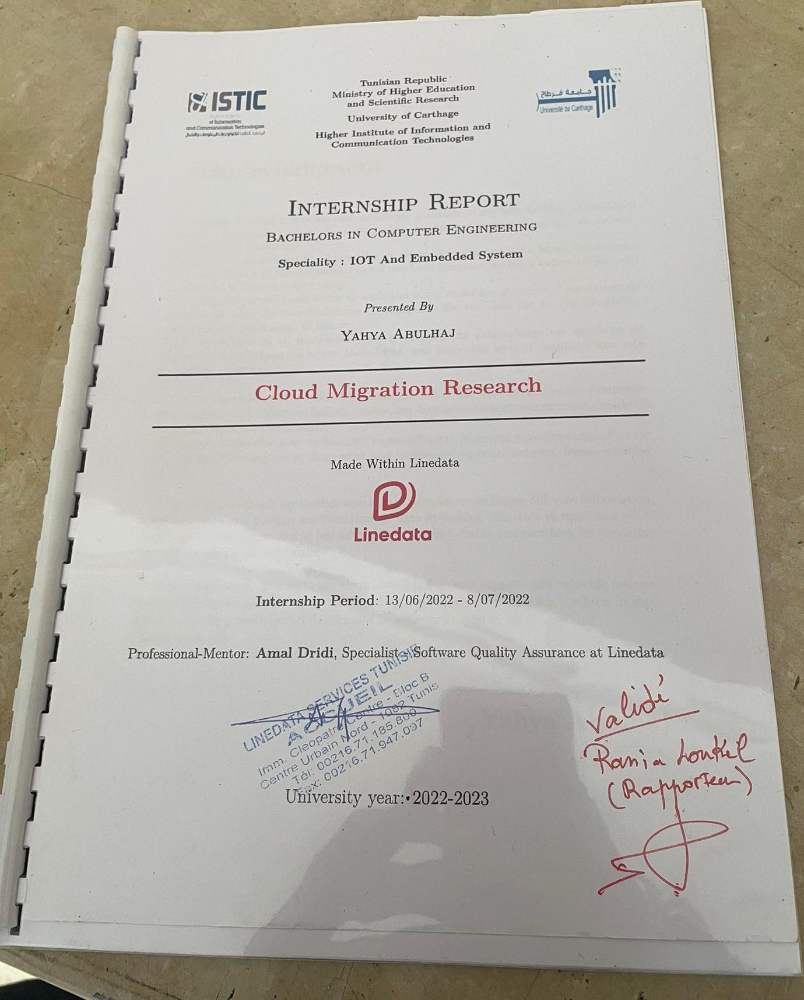

#  Internship Report at Linedata
Hello, please find my report written in Latex of my internship at Linedata below. 
<br>



> I did it for one reason; to become acquainted with book production. Why not write a book one day?


## Template
This is actually a good latex template to consider. LaTeX is a document preparation software system widely employed in creating books and I realized why.

- Consider [this file](aide-memoire_Latex.pdf) to learn about its syntax


The main file is where you should place your first focus: page-order & calling external tex files.

``` 
.LATEX_PROJECT
├── Main.tex
├── chapters.tex
├── Your inspiration.tex
├── assets
    ├── Pictures required, diagrams etc..
``` 
I took advantage of the opportunity to write my CV in Latex as well; A NEAT RESULT! Template is included
