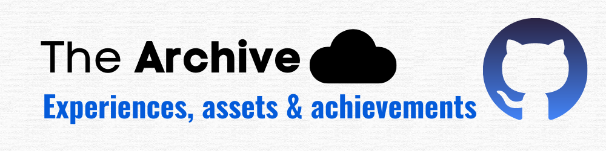

# Experiences - Migration Loading 
This repository is a showcase of my cloud accomplishments and the assets I have earned starting july 2021. 

It highlights my skills and expertise in the cloud and demonstrates my dedication to staying innovative and being unstoppable.
<!--
### Aquired Exams
> Sort by timeline.
- [1- Microsoft Azure Fundamentals](/Certifications!/1°AZ-900.pdf)
- [2- Microsoft Azure Data Fundamentals ](/Certifications!/2°DP-900.pdf)
- [3- Microsoft Azure AI Fundamentals ](/Certifications!/3°AI-900.pdf)
- [4- Microsoft Power Platform Fundamentals ](/Certifications!/4°PL-900.pdf)
- [5- Microsoft Azure Administrator Associate](/Certifications!/5°AZ-104.pdf)
- [6- Microsoft Azure Security Engineer Associate](/Certifications!/6°AZ-500.pdf)
- [7- Microsoft DevOps Engineer Expert](/Certifications!/7°AZ-400.pdf)
- [8- Microsoft Azure Developer Associate](/Certifications!/8°AZ-204.pdf)
- [9- Microsoft Certified Trainer](/Certifications!/MCT.pdf)
- [10- Microsoft Security, Compliance, and Identity Fundamentals](/Certifications!/9°SC-900.pdf)
- [11- Terraform Associate ](/Certifications!/10°Terraform.pdf)
- [12- Microsoft Azure Solutions Architect Expert](/Certifications!/11°AZ-305.pdf)
- [13- Microsoft Azure Network Engineer Associate ](/Certifications!/12°AZ-700.pdf)
- [14- Microsoft Security Operations Analyst Associate](/Certifications!/13°SC-200.pdf)
- [15- AWS Certified Cloud Practitioner ](/Certifications!/14°%20AWS%20Certified%20Cloud%20Practitioner%20certificate.pdf)
 -->

 |▶ [Summer Intern](First_InternReport/README.md)|[▶ Certifications](Certifications!/README.md)|
 |---|---|
 |▶ [Cloud Notes](https://github.com/Y4HYA4/ExperienceInCloud/tree/main/Notes#readme)|▶ [GitHub Grad](https://github.com/Y4HYA4/GitHubGraduation-2022/blob/main/README.md)|

**Main reason of doing so**, I hope to **inspire** and **motivate** others to pursue their own cloud journey and to strive for excellence in their careers.

